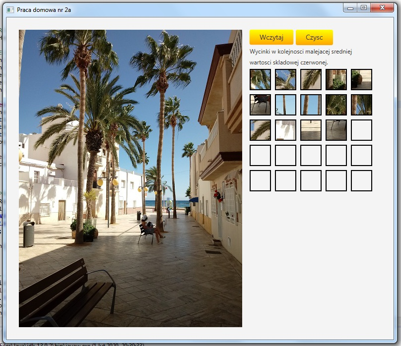

## Table of contents
* [General info](#general-info)
* [Additional info](#additional-info)
* [Screenshot](#screenshot)
* [Technologies](#technologies)
* [Author](#author)

## General info
Image cropping application. Homework 2a for subject INU from Warsaw University of Technology. Image cropping application which can cropp / cut 41x41 pixels image square and show it in arraylist next to canvas with my photo. There is also two buttons - Load new image from file but this option is "under construction" and second option to clear 25 small 41x41px images.

## Additional info
If you want to run these application you have to install JavaFX plugin and add JavaFX libraries and additionaly before start the application - click `Run Configurations...`, choose `(x)= Arguments` and enter `--module-path "out;C:\Program Files (x86)\Java\javafx-sdk-11.0.2\lib" --add-modules=javafx.controls,javafx.fxml` to *VM Arguments* text field where **C:\Program Files (x86)\Java\javafx-sdk-11.0.2\lib** its your javafx sdk location. That's all.

## Screenshot

## Technologies
Project was created with:
* Java 11
* JavaFX

## Author
Marcin Godlewski
